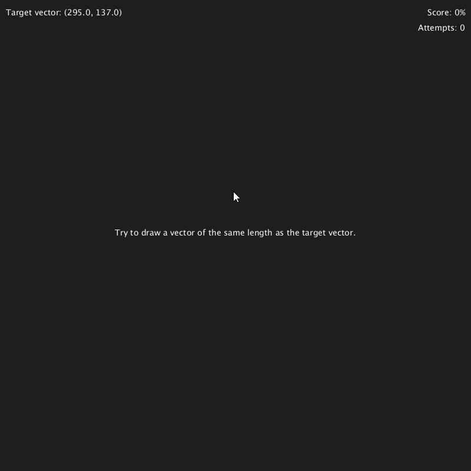

# 03 - Vectors

## Bouncing Ball

Click to shoot the ball in the direction of the mouse.

## Draw the Vector

Try to draw a vector/line that as closley as possible matches the given vector in length.

